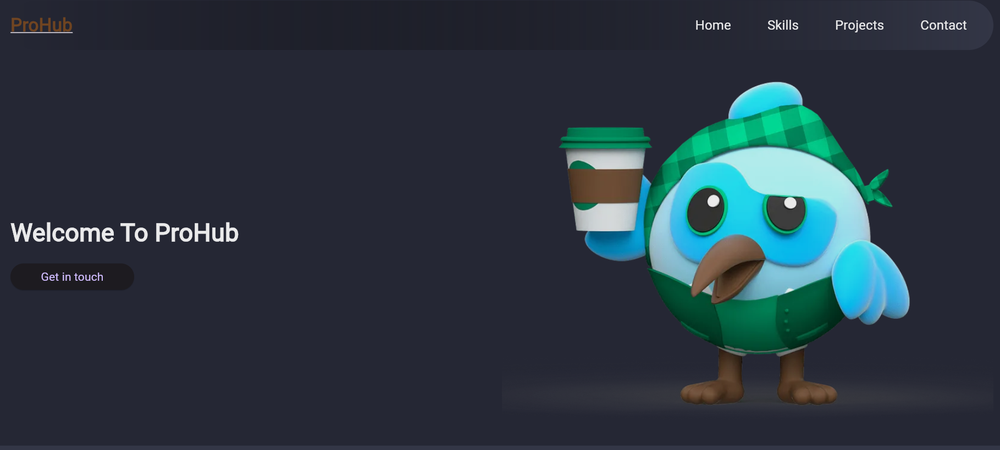

# 🌐 My Portfolio Website

Welcome to my portfolio website! This project showcases my skills, projects, and ways to contact me. Feel free to explore and connect!

## 📸 Preview

## 🚀 Features

- **Responsive Design**: Adapts seamlessly to different screen sizes.
- **Modern UI/UX**: Clean and professional design with easy navigation.
- **Interactive Elements**: Engaging features such as animations and transitions.
- **Contact Form**: Contact me directly through the website.

## 🛠 Technologies Used

- **Flutter**: For building the cross-platform application.
- **Dart**: As the programming language for Flutter.
- **JavaScript**: For additional web functionalities.

## 📂 Project Structure

flutter_portfolio/
├── assets/
│   └── preview.png
├── lib/
│   ├── constants/
│   ├── widgets/
│   ├── main.dart
├── web/
│   ├── index.html
├── README.md

📧 **Contact**
- LinkedIn: [aditya-mishra-41b78b246](https://www.linkedin.com/in/aditya-mishra-41b78b246/)
- GitHub: [aditya05200](https://github.com/aditya05200)
- Medium: [@segueniet](https://medium.com/@segueniet)
- Instagram: [adityamishra_01](https://www.instagram.com/adityamishra_01/)
- Twitter: [machitya25](https://twitter.com/machitya25)

